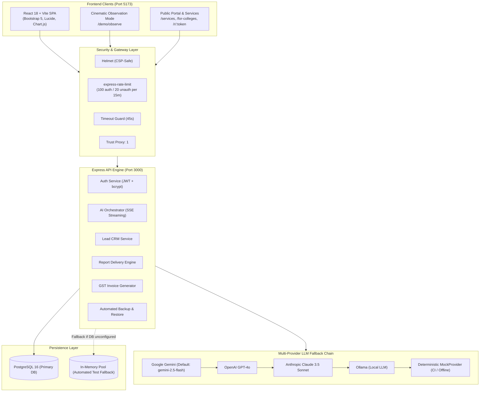

# EduFlow AI — Institutional Intelligence and Automation OS for Indian Higher Education

[](#testing)
[](#testing)
[](#testing)
[](#production-hardening)
[](#render-cloud-deployment)

EduFlow AI is an autonomous institutional automation operating system engineered specifically for Indian colleges and universities. Powered by a specialized multi-LLM engine, EduFlow AI eliminates administrative bottlenecks through five streaming autonomous AI Officers, turnkey accreditation analysis (NAAC/NBA), predictive student retention, conflict-free scheduling, and an automated lead-to-cash service delivery pipeline.

---

## 1. Quick Start & Live Demo

Start the complete full-stack environment locally with a single command from the project root:

```bash
# 1. Start full stack (backend on 3000, frontend on 5173)
npm start
```

Or run backend and frontend independently:

```bash
# Terminal 1 — Backend API
npm --prefix eduflow-backend start

# Terminal 2 — Frontend Web Client
npm --prefix eduflow-core/web run dev
```

### Demo Tenant Details
- **Demo Institution:** Sri Sudha Institute of Technology (SSIT)
- **Institution Code:** `SSIT`
- **Application URL:** [http://localhost:5173](http://localhost:5173)
- **API URL:** [http://localhost:3000](http://localhost:3000)

### Pre-Seeded Demo Credentials
| Role | Email / Identifier | Password | Access Level |
|---|---|---|---|
| **Admin / IQAC Lead** | `admin@demo.edu` | `Demo@2026` | Full system control, lead CRM, invoices, officer execution |
| **Student (Demo)** | `student@demo.edu` | `Demo@2026` | Student portal demo overview |

---

## 2. System Architecture



---

## 3. The 5 Autonomous AI Officers

Each AI Officer acts as a specialized digital twin modeled after Indian higher education administrative functions, streaming tokens in real time via Server-Sent Events (SSE):

| Officer | Persona | Real-Time Streaming Endpoint | Primary Deliverable | Typical Institutional ROI |
|---|---|---|---|---|
| **Accreditation Officer** | Senior NAAC Peer Reviewer (15+ yrs experience) | `POST /api/v1/officers/accreditation/stream` | Audit-grade NAAC Criteria 1–7 SSR Analysis, quantitative score calculations, gap matrix | **40 hrs / ₹25,000** saved per cycle |
| **Student Success Officer** | Academic Retention Counselor & Data Analyst | `POST /api/v1/officers/student-success/stream` | Cohort dropout risk matrix, early attendance warning directives, mentor assignments | **20 hrs / ₹15,000** saved per semester |
| **Timetable Officer** | Operations Research Scheduling Specialist | `POST /api/v1/officers/timetable/stream` | Conflict-free master schedule resolving room capacity, faculty limits, and lab constraints | **32 hrs / ₹18,000** saved per semester |
| **Admissions Officer** | Higher Education Enrollment Director | `POST /api/v1/officers/admissions/stream` | Application conversion forecasting, regional yield predictions, targeted outreach roadmap | **25 hrs / ₹20,000** saved per drive |
| **Finance Officer** | Educational Institution Chartered Accountant | `POST /api/v1/officers/finance/stream` | Student ledger reconciliation, defaulter aging rosters, fee collection forecasts | **35 hrs / ₹22,000** saved per quarter |

---

## 4. Observation Mode

Observation Mode is a zero-click, cinematic demonstration built for college leadership, Deans, and Principals. It showcases all five AI Officers working sequentially in an interactive environment.

- **Direct URL:** `http://localhost:5173/demo/observe?observe=true&host=true`
- **Workflow:**
  1. Automatically launches Step 1 (Accreditation Officer SSR stream) on load.
  2. Sequentially steps through all 5 AI Officers with automated token generation.
  3. Dynamically increments the institutional **ROI Accumulator** (hours and direct money saved).
  4. Concludes with an **Executive ROI Impact Summary Overlay** highlighting institutional velocity.
- **Presenter Bar (`?host=true`):** Enables presentation controls: Play/Pause, Skip to Next Officer, Replay Sequence, and 1x/1.5x/2x playback speed adjustments.

---

## 5. Automation Business Layer (Lead-to-Cash Pipeline)

EduFlow AI delivers end-to-end automation operations through an integrated commercial pipeline:

| Step | Stage | Endpoint / URL | Functionality |
|:---:|---|---|---|
| **1** | **Public Lead Capture** | `/for-colleges` | Public inquiry form with honeypot spam protection, 10-digit Indian phone validation, and service selection. |
| **2** | **Admin CRM** | `/admin-dashboard/leads` | Real-time lead tracker with status pipeline (`NEW` → `CONTACTED` → `PILOT_OFFERED` → `PILOT_DELIVERED` → `WON` → `LOST`). |
| **3** | **Pilot Offer Delivery** | `POST /api/v1/leads/:id/send-pilot-offer` | Generates official email proposal for turnkey institutional pilot packages. |
| **4** | **Report Generation** | `POST /api/v1/officers/:type/stream` | Autonomous streaming generation of structured institutional deliverables. |
| **5** | **Secure Report Delivery** | `POST /api/v1/reports/deliver`<br/>`GET /r/:token`<br/>`GET /r/:token/pdf` | Publishes branded report with unique 32-character hex cryptographic token. Increments view counts and offers pure-JS PDF download. |
| **6** | **Invoice Generation** | `POST /api/v1/invoices`<br/>`GET /api/v1/invoices/:id/pdf` | Automatically creates GST-compliant (18%) invoice with sequential `EDU-YYYY-XXXX` numbering and downloadable PDF. |
| **7** | **Payment Tracking** | `PATCH /api/v1/invoices/:id/mark-paid` | Updates financial ledgers, records payment timestamp, and archives transaction. |

---

## 6. Commercial Services & Pricing

Institutions can deploy individual AI Officers as standalone, turnkey automation services:

| Service ID | Service Title | Officer | Pilot Package Price | Status |
|---|---|---|---|---|
| `accreditation` | **NAAC/NBA Accreditation Report Automation** | Accreditation Officer | **₹50,000** + 18% GST | ✅ Live |
| `student-success`| **Student Dropout Risk Report** | Student Success Officer | **₹15,000** + 18% GST | ✅ Live |
| `timetable` | **Timetable Generator** | Timetable Officer | **₹20,000** + 18% GST | ✅ Live |
| `admissions` | **Admission Yield Predictor** | Admissions Officer | **₹15,000** + 18% GST | ✅ Live |
| `finance` | **Fee Reconciliation** | Finance Officer | **₹10,000** + 18% GST | ✅ Live |
| `hostel` | **Hostel Occupancy Optimizer** | Hostel Officer | **₹25,000** + 18% GST | ⏳ Coming Soon |
| `placement` | **Placement Readiness Report** | Placement Officer | **₹30,000** + 18% GST | ⏳ Coming Soon |

---

## 7. Production Hardening

EduFlow AI is hardened for zero-downtime, production-grade cloud deployment:

- **Reverse Proxy Trust:** `app.set('trust proxy', 1)` configured to accurately extract client IPs on Render / AWS / Cloudflare.
- **Security Headers:** Integrated with `helmet({ contentSecurityPolicy: false })` to protect against clickjacking, MIME-sniffing, and cross-site scripting without breaking SSE streaming or inline PDF generation.
- **Strict Request Timeout:** 45-second timeout middleware guards non-streaming endpoints (`/api/v1/officers/*` non-streaming routes respond with `HTTP 504 Gateway Timeout` if blocked; streaming `/stream` routes are explicitly exempt).
- **Global Rate Limiting:** 
  - Authenticated requests: **100 requests per 15 minutes**
  - Unauthenticated requests: **20 requests per 15 minutes**
- **Startup Environment Validation:** `validateEnv.js` validates that `DATABASE_URL`, `JWT_SECRET` (≥32 chars), `JWT_REFRESH_SECRET` (≥32 chars), `AI_PROVIDER`, and `AI_API_KEY` are configured before binding ports. In production (`NODE_ENV=production`), missing variables immediately exit with code 1.
- **Graceful Shutdown:** Catches `SIGTERM` and `SIGINT` signals, rejects new incoming requests, completes active HTTP/SSE connections within 10 seconds, closes the PostgreSQL connection pool, and terminates cleanly.
- **Optimized Frontend Bundling:** Vite build generates individual chunks for each AI officer (`officer-accreditation`, `officer-timetable`, etc.), precluding oversized vendor bundles.

---

## 8. Database Schema Summary

The database architecture comprises 8 core PostgreSQL tables enforcing institutional multi-tenancy:

1. `institutions` — Multi-tenant college accounts, custom short codes, branding colors, and subscription tiers.
2. `users` — Role-based accounts (`admin`, `faculty`, `student`, `parent`) with bcrypt-hashed passwords.
3. `leads` — Inbound prospective college inquiries captured from `/for-colleges` with status progression.
4. `delivered_reports` — Client deliverables secured via 32-character hexadecimal tokens and view count analytics.
5. `invoices` — GST-compliant invoices auto-numbered as `EDU-YYYY-XXXX` with status and tax breakdowns.
6. `audit_logs` — Tamper-evident administrative action log capturing IP addresses, metadata, and timestamps.
7. `refresh_tokens` — Cryptographic refresh token hashes supporting secure 7-day token rotation.
8. `recent_searches` — Role-based search history and route navigation caching.

---

## 9. Multi-Provider AI Architecture

EduFlow AI abstracts LLM operations via an extensible provider factory. If a provider encounters quota exhaustion or network downtime, the system automatically degrades gracefully across the provider chain:

```
Google Gemini (Default) ➔ OpenAI ➔ Anthropic Claude ➔ Ollama (Local) ➔ MockProvider (Offline)
```

### Configuration
Set `AI_PROVIDER` to one of `gemini`, `openai`, `claude`, or `ollama`. When running unit tests or working offline, the system safely routes requests to `MockProvider` without throwing errors.

---

## 10. Environment Variables Reference

### Backend (`eduflow-backend/.env`)

| Variable | Description | Default | Required in Production |
|---|---|---|:---:|
| `PORT` | API server listen port | `3000` | No |
| `NODE_ENV` | Runtime environment (`development`, `production`, `test`) | `development` | Yes |
| `DB_MODE` | Database mode (`postgres` or `memory`) | `postgres` | Yes |
| `DATABASE_URL` | PostgreSQL connection string | — | **Yes** |
| `JWT_SECRET` | Secret for signing access tokens (≥32 characters) | — | **Yes** |
| `JWT_REFRESH_SECRET` | Secret for signing refresh tokens (≥32 characters) | — | **Yes** |
| `AI_PROVIDER` | Active LLM engine (`gemini`, `openai`, `claude`, `ollama`) | `gemini` | **Yes** |
| `AI_API_KEY` | Secret API key for the selected AI provider | — | **Yes** (except Ollama) |
| `CORS_ORIGIN` | Allowed frontend origin for CORS headers | `http://localhost:5173` | **Yes** |
| `RATE_LIMIT_MAX_AUTH` | Max requests per 15 min for authenticated users | `100` | No |
| `RATE_LIMIT_MAX_UNAUTH` | Max requests per 15 min for public endpoints | `20` | No |
| `RATE_LIMIT_WINDOW_MS` | Rate limiting sliding window in milliseconds | `900000` (15m) | No |
| `LEAD_NOTIFICATION_EMAIL` | Admin email address for new lead notifications | — | No |
| `COMPANY_ADDRESS` | Address printed on generated GST invoices | `Hyderabad, India` | No |

### Frontend (`eduflow-core/web/.env`)

| Variable | Description | Default | Required in Production |
|---|---|---|:---:|
| `VITE_API_BASE_URL` | Fully-qualified backend API base URL | `http://localhost:3000/api` | **Yes** |
| `VITE_DEMO_MODE` | Enables demo indicators and pre-filled presets | `true` | No |

---

## 11. Render Cloud Deployment

EduFlow AI includes a turn-key Render Blueprint specification (`render.yaml`) to deploy the backend, frontend, and PostgreSQL database with zero manual configuration.

### Deployment Steps
1. Push your repository to GitHub.
2. In the [Render Dashboard](https://dashboard.render.com), navigate to **New** ➔ **Blueprint**.
3. Select your repository. Render automatically reads `render.yaml` and provisions:
   - `eduflow-backend` (Node Web Service on starter plan)
   - `eduflow-web` (Static Site on starter plan)
   - `eduflow-postgres` (PostgreSQL 16 Database)
4. In the Render Dashboard, set your private environment variables for `eduflow-backend`:
   - `AI_API_KEY`
   - `CORS_ORIGIN` (set to your frontend Render URL: `https://eduflow-web.onrender.com`)
   - `APP_PUBLIC_URL` (set to `https://eduflow-web.onrender.com`)
5. In `eduflow-web` environment variables, set:
   - `VITE_API_BASE_URL` (set to `https://eduflow-backend.onrender.com/api`)
6. Deploy!

### Production Health Check Endpoints
- `GET /api/health` — Verifies HTTP server availability (`{ ok: true, service: "eduflow-backend", version: "1.0.0" }`)
- `GET /api/health/db` — Verifies database connection (`{ mode: "postgres", persistent: true }`)
- `GET /api/health/render` — Render native deployment probe (`{ status: "ok" }`)

---

## 12. Testing

EduFlow AI maintains comprehensive test coverage across both backend and frontend layers:

```bash
# Run all backend tests (186 tests across 39 suites)
npm --prefix eduflow-backend test

# Run all frontend tests (76 tests across 23 suites)
npm --prefix eduflow-core/web test

# Run code linting
npm --prefix eduflow-core/web run lint

# Run production frontend build
npm --prefix eduflow-core/web run build

# Run the complete test suite runner (all unit, integration, lint, and build checks)
bash scripts/run-all-tests.sh
```

### Current Test Statistics
- **Backend Tests:** **186 / 186 passed** (Auth, JWT, Zod schemas, Officer SSE streams, Leads CRM, Invoices, Delivery tokens, Database persistence, Failover recovery)
- **Frontend Tests:** **76 / 76 passed** (Component renders, Hooks, Streaming officer edge cases, Observation mode, Services directory, Lead intake with honeypot rejection)
- **Total Test Suites:** **62 suites, 262 tests, 0 failures**

---

## 13. Backup & Disaster Recovery

The automated backup daemon backs up the active PostgreSQL database, generates gzipped archives, and maintains a rolling retention policy:

```bash
# Generate immediate gzip database backup
node eduflow-backend/scripts/backup.js

# Interactive restore from backup archive
node eduflow-backend/scripts/restore.js
```

### Retention Policy
- Retains up to **30 daily backups** in `eduflow-backend/backups/daily/`.
- Retains up to **12 monthly archives** in `eduflow-backend/backups/monthly/`.
- Manifest ledger is maintained at `eduflow-backend/backups/manifest.json`.

---

## 14. What Is Built vs. What Is Mocked

| Module | Implementation Status | Technical Details |
|---|:---:|---|
| **5 AI Officers (Streaming)** | ✅ Fully Built | Real SSE endpoints, multi-provider LLM orchestration, structured markdown report streaming. |
| **Observation Mode** | ✅ Fully Built | 5-step automated sequence, presenter toolbar, live ROI calculation, and grand summary. |
| **Lead Capture & CRM** | ✅ Fully Built | Public intake with honeypot anti-spam, admin status pipeline, and notes autosave. |
| **Report Delivery** | ✅ Fully Built | Public 32-char hex token URLs, pure-JS PDF buffer generator, and view analytics. |
| **Invoice Generator** | ✅ Fully Built | Auto-incrementing `EDU-YYYY-XXXX`, 18% GST calculation, and downloadable invoice PDFs. |
| **Auth & Security** | ✅ Fully Built | JWT tokens, bcrypt hash validation, rate limiting, helmet, and request timeouts. |
| **Student / Faculty Portals** | ⚠️ Mock / Demo UI | 70+ presentation screens demonstrating future ERP module interface layouts. |
| **Payment Gateway** | ⏳ Phase 3 Planned | Direct Razorpay / UPI checkout integration. |
| **WhatsApp / SMS Gateway** | ⏳ Phase 3 Planned | Automated notification alerts for admission yield and fee defaulters. |
| **DB-Level Row Level Security (RLS)**| ⏳ Phase 3 Planned | PostgreSQL-native tenant isolation (currently isolated at application query layer). |

---

## 15. License & Contact

**Proprietary Software** — Copyright © 2026 EduFlow AI Technologies, Hyderabad, India. All rights reserved.

For commercial pilots, enterprise inquiries, or technical support:
- **Email:** `contact@eduflow.app` / `support@eduflow.app`
- **Location:** Hyderabad, Telangana, India
