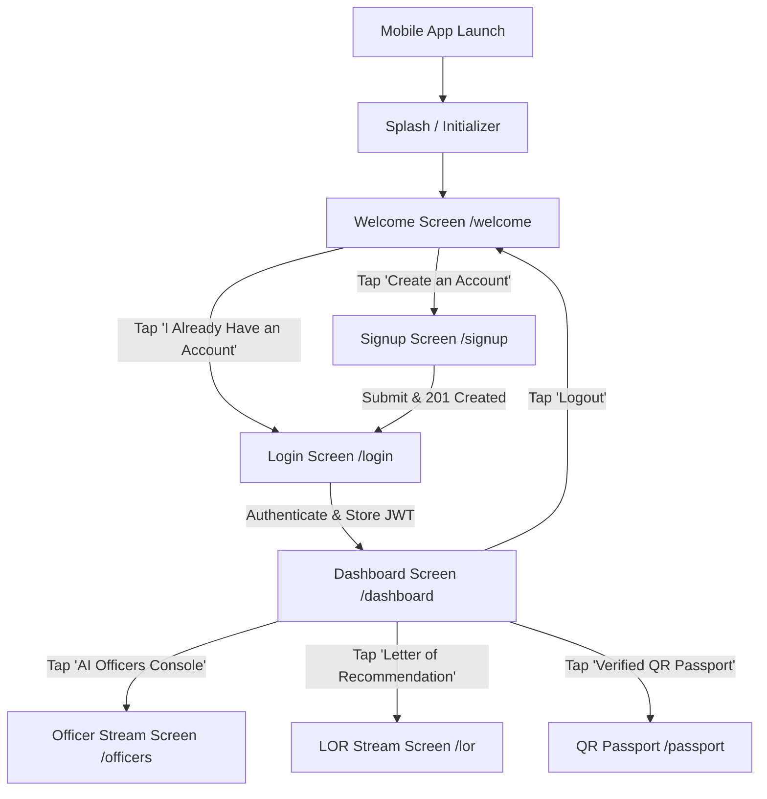
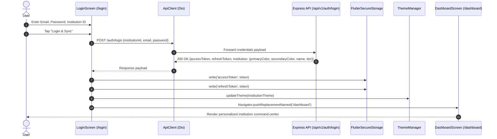
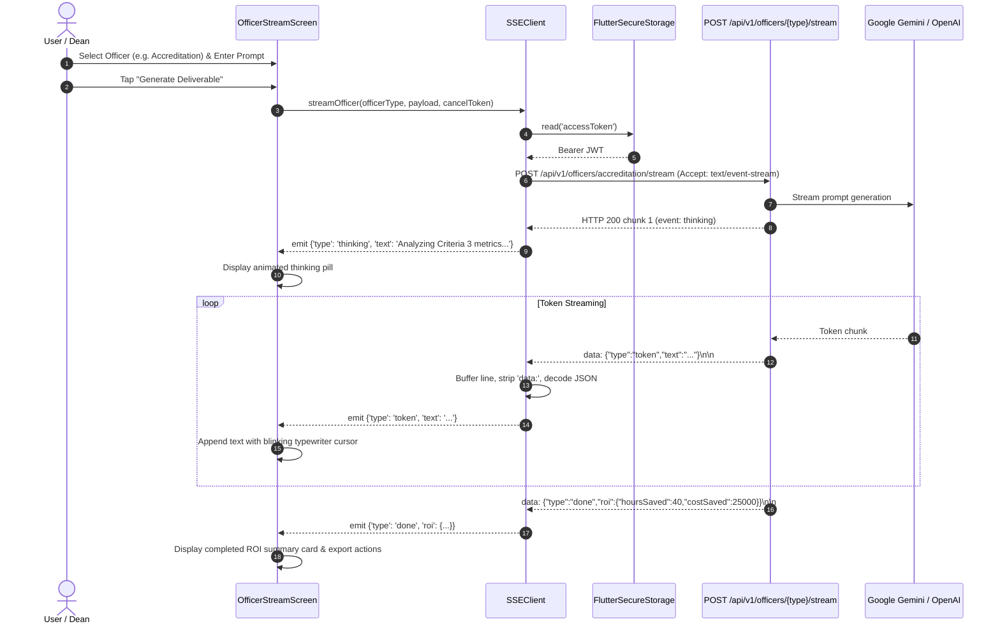

# EduFlow AI OS — Mobile Architecture & Operational Workflow

This document specifies the end-to-end mobile application architecture, navigation lifecycles, authentication mechanisms, real-time SSE streaming protocols, and offline reliability behaviors for the EduFlow AI OS Flutter mobile client.

---

## Section 1: App Launch Flow

The EduFlow AI OS mobile app initializes directly into the educational Landing & Welcome screen (`/welcome`) instead of blocking the user at a raw authentication gate. From this introductory portal, users inspect the 5 AI Officers, review proven institutional ROI metrics, and select either account creation or sign-in.



---

## Section 2: Account Creation Flow

1. **User Initiation**: The user reviews the 5 AI Officers and pricing on the `/welcome` screen and taps the primary **"Create an Account"** call-to-action button, navigating to `/signup`.
2. **Form Input & Client-Side Validation**:
   - **Full Name**: Non-empty text verification.
   - **Institution Name**: Non-empty string; automatically slugified into a normalized subdomain identifier (e.g., `srisuddha`).
   - **Email Address**: Validated against RFC 5322 regex.
   - **Phone Number**: Validated for 10-digit Indian telecommunications format (`^[6-9]\d{9}$`).
   - **Role Selection**: Dropdown selector (`Administrator`, `Faculty`, `Student`, `Parent`).
   - **Password**: Minimum 8 characters with strict confirmation equality matching.
3. **Endpoint Invocation**:
   - The mobile client executes an asynchronous `POST` request to the live backend:
     ```http
     POST /api/v1/institutions/register
     Content-Type: application/json
     ```
   - Request Payload:
     ```json
     {
       "institutionName": "Sri Siddhartha Institute",
       "name": "Sri Siddhartha Institute",
       "subdomain": "srisiddhartha",
       "adminName": "Dr. Ramanathan",
       "email": "dean@ssit.edu",
       "adminEmail": "dean@ssit.edu",
       "phone": "9876543210",
       "password": "SecurePassword2026",
       "role": "admin"
     }
     ```
4. **Backend Processing & Response**:
   - PostgreSQL creates the tenant institution record and provisions the default administrator account.
   - Returns HTTP `201 Created` with institutional metadata and user object.
5. **Success Feedback & Redirection**:
   - A floating green SnackBar notifies the user: `"Account created successfully! Please log in."`
   - The navigator immediately performs `pushReplacementNamed('/login')` with the newly registered credentials ready to authenticate.

---

## Section 3: Login Flow

Upon submitting valid credentials on the login screen, the application exchanges the email/password pair for secure JWT bearer credentials and dynamically loads institutional white-label branding tokens.



---

## Section 4: Officer Streaming Flow on Mobile

The mobile application utilizes a native Dart `Stream` parser built on top of `Dio` with `ResponseType.stream` to ingest real-time Server-Sent Events (SSE) from the EduFlow backend.



---

## Section 5: Services and Pricing Display

The mobile application ensures reliable, zero-latency rendering of automation offerings by decoupling the UI from mandatory external API availability:
1. **Fallback Content Repository (`lib/data/welcome_content.dart`)**:
   - Contains immutable definitions of all 8 automation products, standard unit pricing, and status attributes (`accreditation`: ₹50,000; `timetable`: ₹20,000; `student-success`: ₹15,000; `admissions`: ₹15,000; `finance`: ₹10,000; `fee-reconciliation`: ₹12,000; `hostel`: ₹25,000 [Coming Soon]; `placement`: ₹30,000 [Coming Soon]).
2. **Hybrid Ingestion Model**:
   - When the welcome screen mounts, it loads instantaneously from `mockServices` and `mockOfficers`.
   - When connected online, future revisions allow background polling to refresh pricing models from `/api/v1/pricing` without disrupting initial rendering.

---

## Section 6: Logout Flow

Session invalidation is strictly synchronous and secure:
1. When the user taps the Logout button on `DashboardScreen`, `_logout(BuildContext context)` is triggered.
2. `FlutterSecureStorage().deleteAll()` purges both `accessToken` and `refreshToken` from the hardware-backed keystore/keychain.
3. `ThemeManager().resetToDefault()` resets institutional colors to standard EduFlow palette.
4. `Navigator.of(context).pushNamedAndRemoveUntil('/welcome', (route) => false)` clears the entire navigation history stack and safely resets the app state back to the Welcome Screen.

---

## Section 7: Offline Behavior

- **Zero-Network Resilience**: Because all layout configurations, officer descriptions, ROI metrics, and pricing tables reside in `lib/data/welcome_content.dart`, the Welcome Screen renders completely offline.
- **Graceful Failure Handling**: If the user submits the Signup or Login form without network connectivity, `DioException` catches the connection socket timeout and presents an inline error banner without crashing the application.

---

## Section 8: Known Mobile Limitations (Phase 2 Roadmap)

The following capabilities are intentionally deferred for the Phase 2 mobile release:
1. **Push Notifications & Firebase Cloud Messaging (FCM)**: Remote alerts for report delivery.
2. **Biometric Authentication (Fingerprint / FaceID)**: Local credential unlocking via LocalAuth.
3. **Offline Streaming**: Full local offline LLM caching when severed from backend APIs.
4. **Third-Party Paid Gateways**: Direct Razorpay SDK in-app purchasing and WhatsApp notifications.

---

## Section 9: Build Commands

```bash
cd ~/Github/EduFlowAI/eduflow-core/mobile
flutter clean
flutter pub get
flutter analyze
flutter test
flutter build apk --release --dart-define=API_BASE_URL=https://eduflow-backend-jvn8.onrender.com/api/v1
```

Output APK location:
`build/app/outputs/flutter-apk/app-release.apk`
