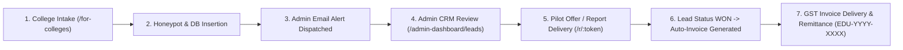
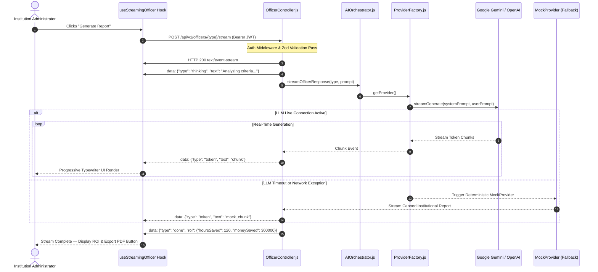
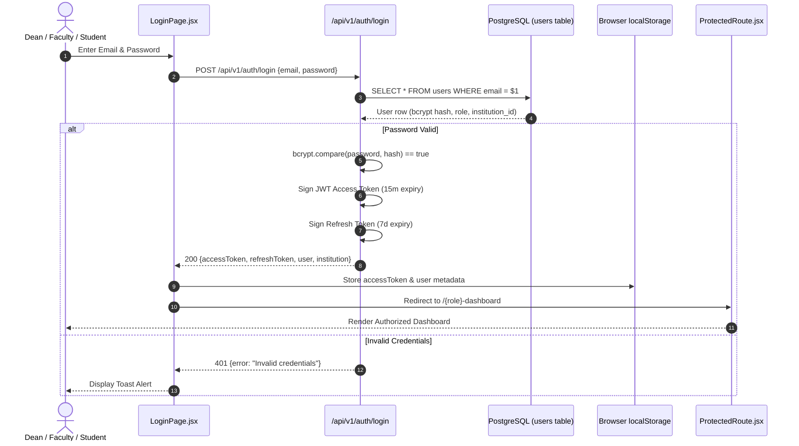
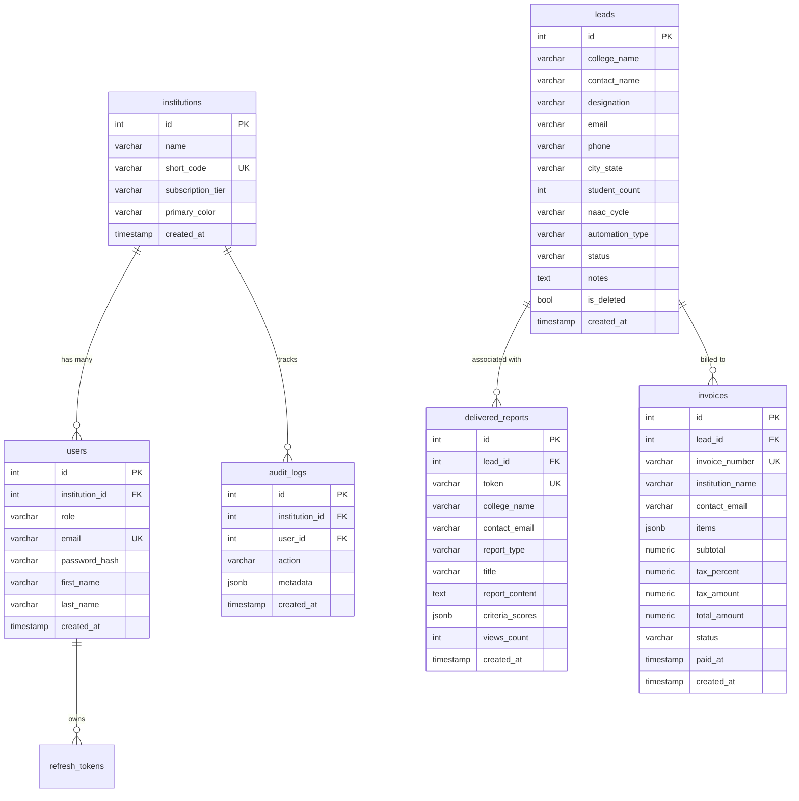

# EduFlow AI OS — Complete System Architecture & Operational Workflow

---

## Section 1: What EduFlow AI Does

EduFlow AI OS is an administrative AI automation platform engineered specifically for Indian higher education institutions (universities, autonomous colleges, and polytechnics). Instead of replacing faculty with rigid ERPs, EduFlow deploys a specialized virtual administrative workforce composed of five domain-focused AI Officers (Accreditation, Student Retention, Timetable, Admissions, and Finance). These officers ingest complex regulatory constraints, institutional student rosters, and financial ledgers to autonomously synthesize audit-grade documentation—such as NAAC Self Study Reports (SSR), NBA compliance matrices, and conflict-free master timetable schedules—within minutes rather than weeks.

From a business model perspective, EduFlow operates as an **Automation-as-a-Service (AaaS)** turnkey delivery platform. Institutional leaders (principals, deans, and IQAC directors) select pre-packaged service audits—such as a 72-hour NAAC SSR gap analysis for ₹50,000—which are processed by the AI workforce and delivered through cryptographically secured, branded public links accompanied by GST-compliant invoices. This service-first model provides rapid immediate monetization without requiring institutions to endure multi-month software rollouts or complex internal migrations.

---

## Section 2: The 8 Automation Services

| Service | Trigger | Input Data | AI Officer | Deliverable Output | Pricing (INR) | Delivery Method |
|---|---|---|---|---|---|---|
| **NAAC/NBA SSR Automation** | Public intake form or admin dispatch | Institutional SSR metrics & Cycle | Accreditation Officer | 7-Criterion Gap Analysis, Metrics, & SSR Executive Summary | ₹50,000 + 18% GST | Secure `/r/:token` link & PDF download |
| **Student Dropout Risk Alert** | Cohort exam or semester registration | Attendance records & backlog history | Student Success Officer | Urgency Matrix, Intervention Directives & Retention Forecast | ₹15,000 + 18% GST | Admin workbench & IQAC PDF |
| **Conflict-Free Timetable** | Department term scheduling | Faculty workload & room/lab limits | Timetable Officer | Clash-free master scheduling grid & faculty hours report | ₹20,000 + 18% GST | Interactive grid & Excel/PDF export |
| **Admission Yield Predictor** | Applicant intake cycle | Application scores & demographic pool | Admissions Officer | Yield rate probability & regional conversion strategy | ₹15,000 + 18% GST | Executive enrollment forecast PDF |
| **Fee Reconciliation** | Monthly or term fee collection | Bank statements & ERP fee ledger | Finance Officer | Defaulter aging list, ledger reconciliation, UPI audit | ₹10,000 + 18% GST | Reconciled ledger & GST audit PDF |
| **Fee Reconciliation (Detailed)** | End-of-year audit | Full annual bank statement & cashbook | Finance Officer | Line-item transaction variance audit & escrow breakdown | ₹12,000 + 18% GST | Audit-grade spreadsheet & PDF |
| **Hostel Occupancy Optimizer** | Academic session intake | Bed inventory, gender ratios, curfews | Digital Twin Engine | Dynamic room mapping & mess capacity plan | ₹25,000 + 18% GST | Coming Soon (Phase 2) |
| **Placement Readiness Report** | Pre-campus placement drive | Student resumes & recruiter benchmarks | Career Forge Engine | Batch readiness index & interview sentiment score | ₹30,000 + 18% GST | Coming Soon (Phase 2) |

---

## Section 3: The Lead to Cash Workflow



1. **Intake Submission:** An institutional leader navigates to `/services` or `/for-colleges`, selects a pilot tier (e.g., Timetable or Accreditation), and submits college details, student count, and contact info.
2. **Anti-Spam & Ingestion:** `LeadController.js` performs honeypot verification and Zod schema validation, persisting the record to PostgreSQL with status `NEW`.
3. **Internal Notification:** The system dispatches an alert email to `LEAD_NOTIFICATION_EMAIL` (falling back to structured JSON logging) with full college details.
4. **Administrative Review:** The admin opens `/admin-dashboard/leads`, reviews incoming leads, updates the status to `CONTACTED`, and sends a one-click pilot offer.
5. **Report Generation & Delivery:** The administrator executes the AI Officer generation and calls `/api/v1/reports/deliver`, which creates a 32-character hex token and sends the dean a branded URL (`/r/:token`).
6. **Lead Won & Automated Invoicing:** Transitioning the lead status to `WON` automatically triggers `InvoiceRepository.create()`, which calculates the statutory 18% GST and formats the line items.
7. **Settlement & Remittance:** The dean views the report, downloads the PDF, reviews the tax invoice (`EDU-YYYY-XXXX`), and initiates bank remittance to company bank details.

---

## Section 4: The AI Officer Streaming Workflow



---

## Section 5: The Authentication Workflow



---

## Section 6: The Observation Mode Workflow

1. **Host Launch:** Presenter navigates to `/demo/observe?observe=true&host=true`.
2. **Auto-Sequence Initialization:** The UI loads `demoSequence.js` containing the choreographed 5-step demonstration for institutional stakeholders.
3. **Step 1 (Accreditation Officer):** Starts autonomous SSE stream; real-time research gap SSR analysis renders progressive typewriter tokens. Emits completion payload (`hoursSaved: 120`, `moneySaved: ₹3,00,000`).
4. **Inter-Step Breather:** The system pauses for 2,500ms with smooth animated transitions to allow presenters to explain ROI to executive audiences.
5. **Step 2 (Student Success Officer):** Automatically triggers dropout risk scanning across 50 students; accumulates saved hours and metrics.
6. **Steps 3 to 5 (Timetable, Admissions, Finance):** Sequentially executes conflict resolution, yield forecasting, and fee ledger reconciliation.
7. **Master ROI Accumulation:** After Step 5, the observation view surfaces the comprehensive Institutional Savings Overlay (total ₹3,49,350+ consulting cost saved across 174.5+ human hours).

---

## Section 7: The Database Schema



---

## Section 8: The Deployment Pipeline

1. **Code Push:** Developer pushes changes to branch `main` on GitHub (`origin/main`).
2. **Render Trigger:** Render listens to GitHub webhooks and initiates unified blueprint provisioning defined in `render.yaml`.
3. **Migration & Seeding Execution:** Because Render Free Tier does not support standalone `preDeployCommand`, database provisioning is chained directly into the backend startup command:
   ```bash
   bash scripts/migrate-and-seed.sh && node src/server.js
   ```
4. **Schema Convergence:** `migrate-and-seed.sh` applies `sql/schema.sql` and `src/db/migrations/005_automation_tables.sql` idempotently, ensuring tables (`leads`, `delivered_reports`, `invoices`) and columns (`automation_type`) are present.
5. **Static Frontend Compilation:** Render Static Site builder runs `npm ci && npm run build` for `eduflow-core/web`, outputting optimized chunked static assets into `dist/`.
6. **Health Verification:** Render reverse proxy queries `/api/health` and `/api/health/db`. Once HTTP 200 is confirmed, traffic is routed to the new deployment.

---

## Section 9: Error Handling Strategy

1. **Controller Isolation:** Every route handler wraps execution in standard `try / catch` blocks, returning structured JSON errors (`{ error: string, status: number }`) without crashing the process.
2. **Global Fallback Middleware:** Uncaught exceptions bubble to Express `errorHandler` in `app.js`, ensuring status 500 responses with sanitized messages.
3. **Database Memory Fallback:** `pool.js` catches PostgreSQL connection refusals and falls back to an in-process array pool (`memoryPool.js`), ensuring test suites and local sandboxes run without live databases.
4. **AI Provider Fallback:** `ProviderFactory.js` wraps cloud API calls with fallback listeners. If Google Gemini or OpenAI times out or fails, the system switches to `MockProvider.js` to preserve stream integrity.
5. **Frontend Error Boundaries:** All major views and streaming officers are wrapped in `<ErrorBoundary>`, displaying helpful reset actions rather than blank screens.
6. **Graceful Shutdown:** `server.js` listens for `SIGTERM` and `SIGINT`, cleanly closing the HTTP server, draining the PostgreSQL connection pool, and disconnecting Redis before terminating.

---

## Section 10: Phase 2 Roadmap (Deferred Paid Features)

The following integrations are intentionally scheduled for Phase 2 commercial rollouts to maintain a lean, zero-cost operational overhead during initial pilot validation:

* **Razorpay / Stripe Payment Gateway:** Automated webhook processing to transition invoices from `UNPAID` to `PAID` upon UPI, net banking, or corporate credit card settlement.
* **SMS & OTP Verification (Twilio / Gupshup):** Two-factor authentication for administrative logons and urgent SMS notifications for campus emergency alerts.
* **WhatsApp Business Messaging API:** Direct institutional report delivery and attendance deficit notices sent to parents' WhatsApp accounts via official Meta Cloud APIs.
* **Firebase Cloud Messaging (FCM):** Push notification routing for native mobile applications.
* **Hostel & Placement Full Integration:** Comprehensive dynamic room reservation matrix and recruiter resume matching algorithms.
