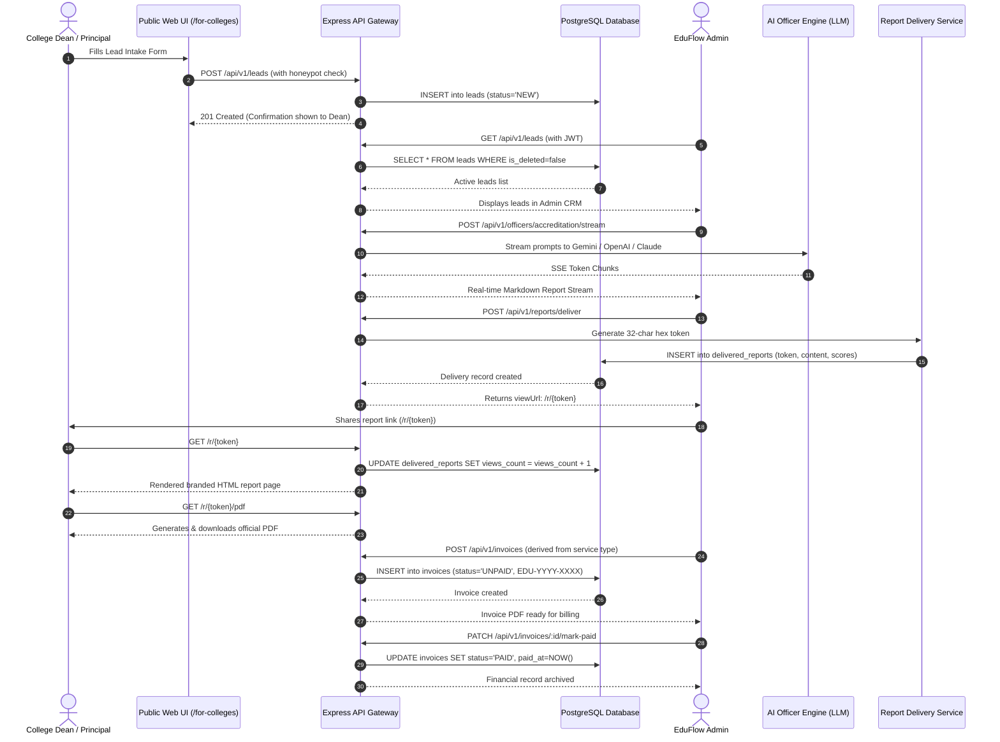
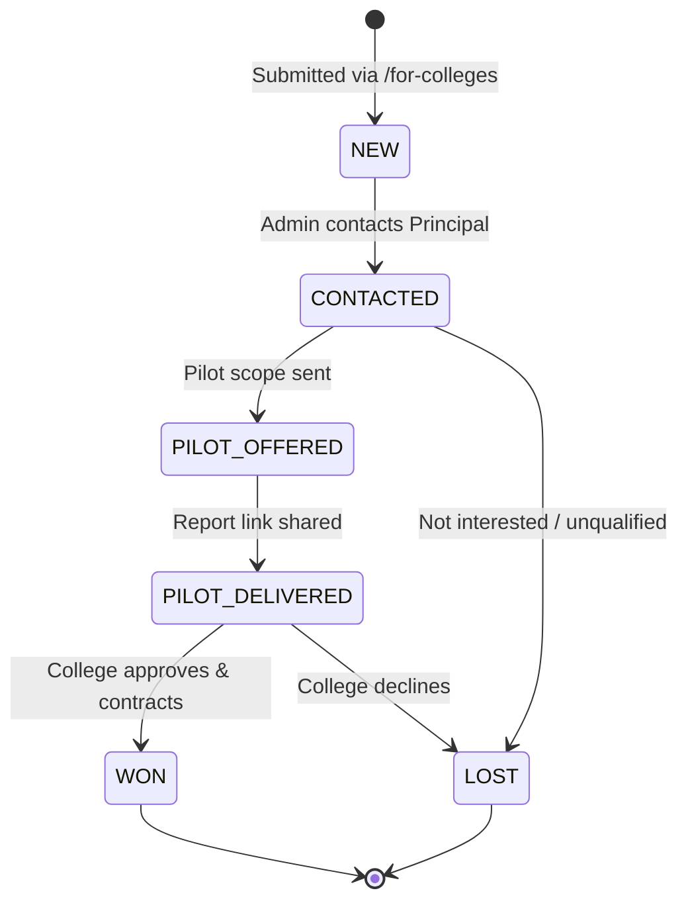
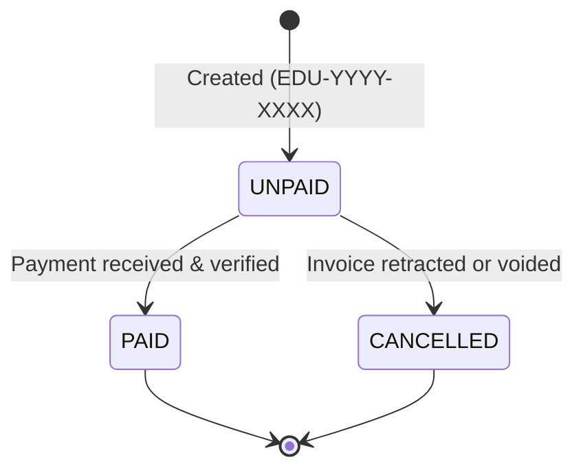
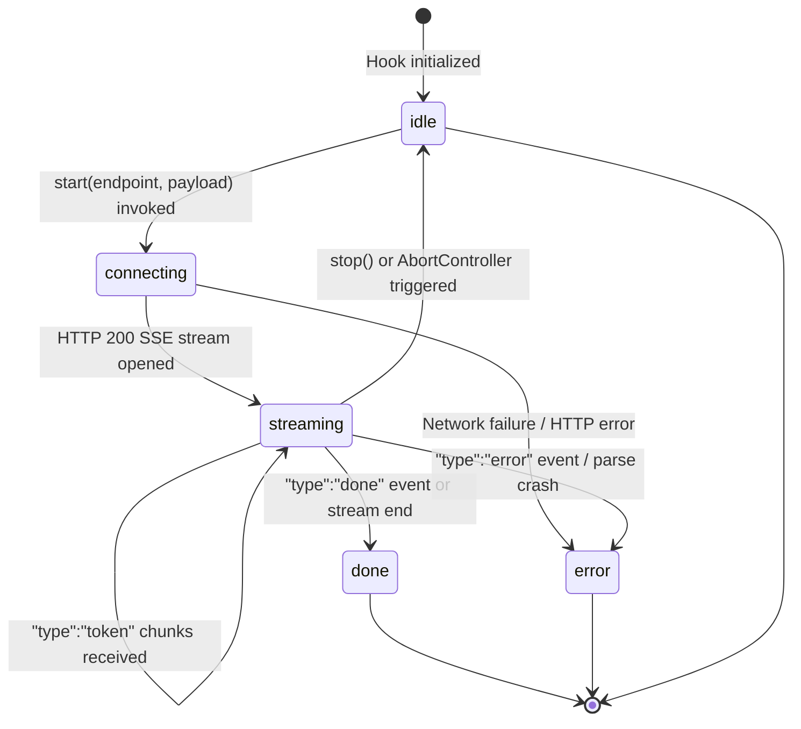
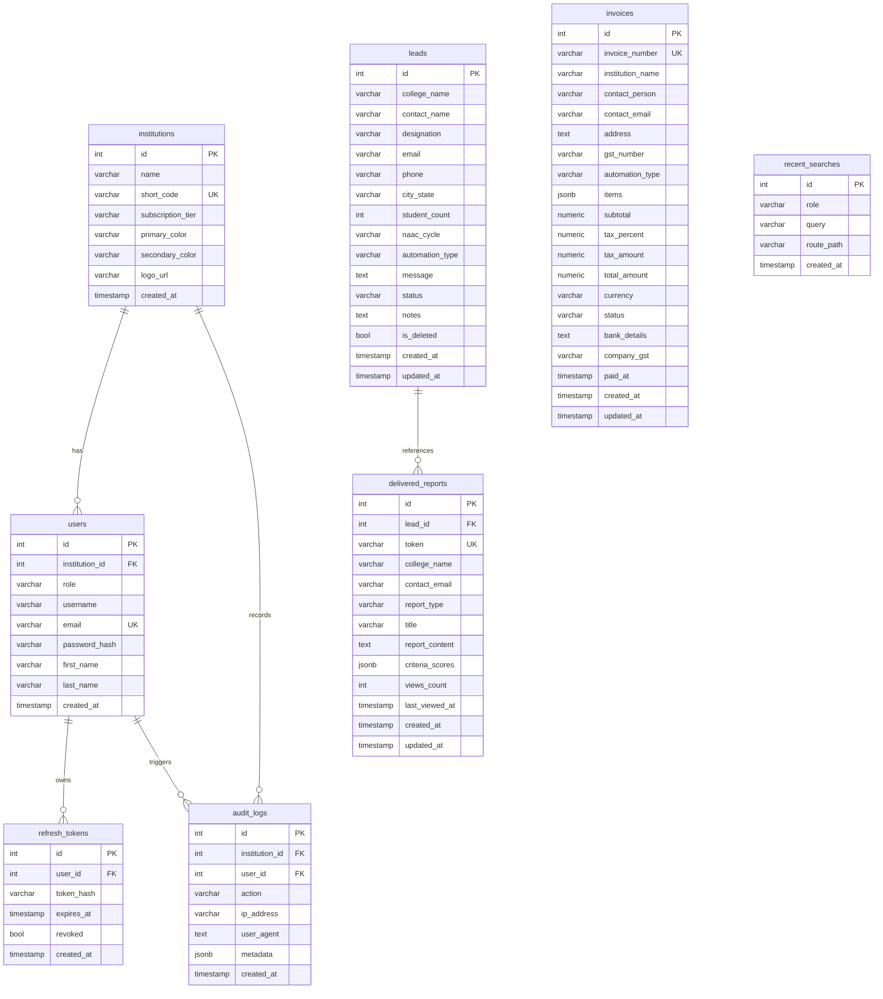

# EduFlow AI OS — System Architecture & Workflow Specification

This document provides the definitive operational and technical reference for EduFlow AI OS, detailing user journeys, sequence diagrams, state machines, internal data models, security architectures, and deployment runbooks.

---

## 1. Executive Summary

### What EduFlow AI Is
EduFlow AI is an autonomous institutional intelligence and administrative operating system engineered specifically for Indian higher education institutions (universities, engineering colleges, polytechnics, and standalone business schools).

### Target Audience
- **Chancellors, Principals & Deans:** Looking to automate resource-intensive administrative workflows without deploying cumbersome enterprise ERP suites.
- **IQAC (Internal Quality Assurance Cell) Coordinators:** Requiring audit-grade SSR documentation aligned with NAAC Revised Accreditation Framework (RAF) and NBA OBE criteria.
- **Heads of Departments & Registrars:** Managing scheduling clashes, retention interventions, and admissions targeting.
- **Administrative & Finance Officers:** Reconciling student fee ledgers and institutional accounts.

### Problem Solved
Traditional higher education operations in India suffer from severe manual friction:
1. **Accreditation SSR Bottlenecks:** Preparing NAAC/NBA self-study reports currently consumes 3 to 6 months of faculty time, diverting educators from teaching.
2. **Untracked Student Dropout Risk:** Academic dropouts are detected reactively after final exams rather than during mid-semester warning periods.
3. **Complex Timetable Scheduling:** Manual timetable scheduling frequently results in room clashes, faculty overload, and suboptimal lab utilization.
4. **Scattered Fee Defaulter Reconciliation:** Fee accounts remain disconnected across bank statements, manual ledgers, and student registries.

EduFlow AI resolves these challenges through **five autonomous AI Officers** capable of streaming institutional intelligence deliverables in minutes rather than weeks.

---

## 2. Complete User Journeys

### 2.1 College Principal / Dean Journey
1. **Discovery:** The Principal lands on `/services` or `/for-colleges`, reviewing specialized institutional automation offerings (e.g., NAAC SSR Report Automation or Dropout Risk Assessment).
2. **Inquiry Submission:** Fills the institutional intake form specifying institution details, student count, NAAC cycle, and target bottleneck. Honeypot anti-spam verifies human submission.
3. **Review & Proposal:** Receives an institutional pilot proposal and consultation confirmation within 24 hours.
4. **Secure Report Access:** Receives a secure link (`/r/{token}`) containing the generated deliverable. The Principal can view the live branded report on mobile or desktop without creating an account.
5. **Executive Review:** Inspects criterion scores, quantitative gap analyses, and immediate IQAC action items.
6. **PDF Download:** Clicks "Download Official PDF" to obtain an audit-compliant `%PDF-1.4` document ready for committee distribution.

### 2.2 Administrator Journey
1. **Secure Login:** Authenticates at `/login` as `admin@demo.edu` using bcrypt-verified credentials.
2. **Lead Triage (`/admin-dashboard/leads`):** Reviews inbound inquiries from prospective institutions. Changes status from `NEW` to `CONTACTED` or `PILOT_OFFERED`. Adds internal notes with automatic autosave.
3. **Triggering Deliverables:** Accesses AI Officer consoles to execute custom reports for the client institution, streaming LLM outputs in real time.
4. **Delivering the Report:** Clicks "Deliver to Client", which persists the report in `delivered_reports` and generates an unguessable 32-character hexadecimal token.
5. **Invoicing (`/admin-dashboard/invoices`):** Generates a GST-compliant invoice auto-numbered as `EDU-YYYY-XXXX`, with an automatically derived fee based on the service type.
6. **Payment Reconciliation:** Upon receiving payment, marks the invoice as `PAID`, timestamping the audit trail.

### 2.3 Demo Presenter Journey
1. **Pre-Flight Validation:** Runs `bash scripts/demo-check.sh` to confirm backend health, database mode, and AI connectivity.
2. **Observation Mode Launch:** Opens `/demo/observe?observe=true&host=true` on the presentation projector.
3. **Autonomous Streaming:** Lets the system run through all 5 AI Officers sequentially:
   - Step 1: Accreditation Officer (NAAC Criteria SSR generation)
   - Step 2: Student Success Officer (Dropout risk prediction matrix)
   - Step 3: Timetable Officer (Conflict-free scheduling grid)
   - Step 4: Admissions Officer (Application yield forecast)
   - Step 5: Finance Officer (Fee ledger reconciliation)
4. **Live ROI Showcase:** Directs the audience's attention to the live ROI counter accumulating hours and consulting rupees saved in real time.
5. **Grand Impact Summary:** Points to the terminal summary showing total hours and consulting fees saved.
6. **The 30-Day Pilot Ask:** Concludes the presentation with the zero-risk 30-day pilot offer: *"We will generate your complete NAAC SSR framework at zero cost. If it saves your IQAC team time, we discuss subscription. If not, you owe nothing."*

---

## 3. Technical Data Flow

The complete commercial flow from public lead submission to payment reconciliation:



---

## 4. State Machines

### 4.1 Lead Status Lifecycle



### 4.2 Invoice Status Lifecycle



### 4.3 Streaming Connection Lifecycle



---

## 5. AI Officer Deep Dive

EduFlow AI utilizes five specialized AI personas. Each officer has custom prompts, validation schemas, and failure recovery protocols:

### 1. Accreditation Officer
- **Persona:** Senior NAAC Peer Team Reviewer with 15+ years experience.
- **Endpoints:** `POST /api/v1/officers/accreditation/stream` (SSE), `POST /api/v1/officers/accreditation/generate` (Sync).
- **Core Capabilities:** Analyzes qualitative and quantitative metrics across NAAC Criteria 1–7 (Curricular Aspects, Teaching-Learning, Research, Infrastructure, Student Support, Governance, Institutional Values). Identifies metric score shortfalls and generates actionable SSR remediation roadmaps.
- **Fallback Behavior:** If primary LLM quota is exhausted, falls back to secondary provider or the deterministic MockProvider, returning a structured SSR framework.

### 2. Student Success Officer
- **Persona:** Academic Counselor and Student Retention Analytics Specialist.
- **Endpoints:** `POST /api/v1/officers/student-success/stream` (SSE), `POST /api/v1/officers/student-success/predict-risk` (Sync).
- **Core Capabilities:** Examines attendance patterns, internal assessment scores, and engagement logs to predict dropout likelihood. Classifies students into High, Moderate, and Low risk cohorts with specific mentor directives.

### 3. Timetable Officer
- **Persona:** Operations Research and Educational Scheduling Specialist.
- **Endpoints:** `POST /api/v1/officers/timetable/stream` (SSE), `POST /api/v1/officers/timetable/generate` (Sync).
- **Core Capabilities:** Resolves multidimensional scheduling constraints: room capacities, laboratory availability, faculty weekly workload limits, and departmental curriculum requirements. Emits conflict-free schedule matrices.

### 4. Admissions Officer
- **Persona:** Higher Education Strategic Enrollment Director.
- **Endpoints:** `POST /api/v1/officers/admissions/stream` (SSE), `POST /api/v1/officers/admissions/predict-yield` (Sync).
- **Core Capabilities:** Scores prospective applicant inquiries, analyzes geographic and demographic yield trends, and predicts final enrollment numbers.

### 5. Finance Officer
- **Persona:** Educational Institution Chartered Accountant and Financial Controller.
- **Endpoints:** `POST /api/v1/officers/finance/stream` (SSE), `POST /api/v1/officers/finance/reconcile` (Sync).
- **Core Capabilities:** Compares student fee accounts with incoming bank settlement feeds. Flags aging defaulter lists, reconciles unallocated payments, and calculates budget variances.

---

## 6. Observation Mode Internals

Observation Mode (`/demo/observe`) is engineered to execute an automated multi-officer demonstration without presenter manual intervention.

### Sequence Orchestration
The sequence is driven by `eduflow-core/web/src/pages/demo/demoSequence.js`, defining an array of 5 steps:
1. **Accreditation Officer** (`/api/v1/officers/accreditation/stream`)
2. **Student Success Officer** (`/api/v1/officers/student-success/stream`)
3. **Timetable Officer** (`/api/v1/officers/timetable/stream`)
4. **Admissions Officer** (`/api/v1/officers/admissions/stream`)
5. **Finance Officer** (`/api/v1/officers/finance/stream`)

### Execution Lifecycle
- **Auto-Start (`?observe=true`):** Automatically starts Step 1 after a 100ms initialization delay.
- **Breather Period:** Once an officer stream emits `done`, the system pauses for `2500ms / playbackSpeed` to allow the audience to read the conclusion, before auto-advancing to the next step.
- **ROI Counter Accumulation:** After each step completes, its predefined ROI values (hours and rupees saved) are added to `accumulatedROI` and animated into view.
- **Summary Overlay:** When all 5 steps finish, an impact modal renders highlighting total hours and financial savings.
- **Presenter Toolbar (`?host=true`):** Renders floating controls for Play/Pause, Skip to Next Step, Replay from Step 1, and 1x/1.5x/2x speed adjustment.

---

## 7. Database Entity Relationships



---

## 8. Security Model

EduFlow AI applies defense-in-depth principles across transport, authentication, and application layers:

### 1. JWT Authentication Lifecycle
- **Access Tokens:** Signed with HMAC-SHA256 (`JWT_SECRET`), valid for 15 minutes. Contains `{ userId, institutionId, role, email }`.
- **Refresh Tokens:** Signed with `JWT_REFRESH_SECRET`, valid for 7 days. Stored as SHA-256 hashes in `refresh_tokens`. Supports revocation on logout.
- **Passwords:** Hashed with `bcryptjs` using 10 salt rounds. Never logged or exposed in responses.

### 2. Rate Limiting
- Configured via `express-rate-limit` mounted across `/api/v1/*`.
- **Authenticated users:** 100 requests per 15 minutes.
- **Unauthenticated endpoints:** 20 requests per 15 minutes.
- Emits standard `RateLimit-*` headers and `HTTP 429 Too Many Requests` with retry instructions.

### 3. Helmet & Reverse Proxy Hardening
- `app.set('trust proxy', 1)` enables accurate IP extraction behind Render and Cloudflare reverse proxies.
- `helmet({ contentSecurityPolicy: false })` enables anti-clickjacking (`X-Frame-Options: SAMEORIGIN`), MIME-type sniffing defense (`X-Content-Type-Options: nosniff`), and strict referrers, while preserving inline streaming SSE connections and client PDF rendering.

### 4. Honeypot Anti-Spam
- The public lead intake form includes a hidden `website` field with `tabIndex="-1"`, `aria-hidden="true"`, and CSS `display: none`.
- Bots that populate this field are rejected client-side; any incoming request with a non-empty `website` parameter receives an HTTP 400 rejection from the API without database insertion.

### 5. Input Validation
- All inbound route payloads are validated via Zod schemas prior to reaching database or controller logic (`authSchema`, `leadSchema`, `invoiceSchema`, `reportDeliverySchema`, `officerSchema`).
- Requests with malformed fields return descriptive `HTTP 400 Bad Request` validation error arrays.

---

## 9. Disaster Recovery Runbook

EduFlow AI includes built-in database backup and restoration daemons.

### 1. Generating an Immediate Backup
```bash
# Execute from project root
node eduflow-backend/scripts/backup.js
```
- Emits a compressed gzip archive: `eduflow-backend/backups/daily/YYYY-MM-DD.sql.gz`.
- Maintains a ledger manifest at `eduflow-backend/backups/manifest.json`.
- Enforces rolling retention: maximum **30 daily backups** and **12 monthly archives**.

### 2. Verifying Backup Integrity
```bash
# Verify gzip integrity and inspect header
gzip -t eduflow-backend/backups/daily/*.sql.gz
echo "Archive check exit code: $?"
```

### 3. Executing a Database Restore
```bash
# Run the interactive restoration script
node eduflow-backend/scripts/restore.js
```
- Prompts the administrator to select from available backup archives.
- Requires typing `YES` to confirm overwriting the active database.
- Streams the decompressed SQL dump directly into the target PostgreSQL instance via `DATABASE_URL`.

---

## 10. Production Deployment Runbook

### Render Blueprint Deployment
Deploying EduFlow AI to Render requires no manual infrastructure provisioning:

1. **Push Changes:** Ensure your latest commits are pushed to the `main` branch on GitHub.
2. **Open Render:** Navigate to [Render Dashboard](https://dashboard.render.com) ➔ **New** ➔ **Blueprint**.
3. **Connect Repository:** Link the EduFlow AI repository. Render parses `render.yaml` and sets up:
   - Web Service: `eduflow-backend` (Node.js)
   - Static Site: `eduflow-web` (React build in `dist/`)
   - Managed Database: `eduflow-postgres` (PostgreSQL 16)
4. **Environment Variables Configuration:**
   In the Render dashboard for `eduflow-backend`, verify or set:
   - `AI_PROVIDER`: `gemini` (or `openai`, `claude`, `ollama`)
   - `AI_API_KEY`: Your provider API key
   - `CORS_ORIGIN`: Your frontend URL (`https://eduflow-web.onrender.com`)
   - `APP_PUBLIC_URL`: Your frontend URL (`https://eduflow-web.onrender.com`)
   In `eduflow-web`:
   - `VITE_API_BASE_URL`: `https://eduflow-backend.onrender.com/api`
5. **Post-Deployment Verification:**
   Execute the following curl checks against the live production URL:
   ```bash
   # 1. Base health check
   curl -s -i https://eduflow-backend.onrender.com/api/health
   # Expected: HTTP 200 {"ok":true,"service":"eduflow-backend","version":"1.0.0"}

   # 2. Database connectivity
   curl -s -i https://eduflow-backend.onrender.com/api/health/db
   # Expected: HTTP 200 {"mode":"postgres","persistent":true}

   # 3. Render cloud probe
   curl -s -i https://eduflow-backend.onrender.com/api/health/render
   # Expected: HTTP 200 {"status":"ok"}
   ```
